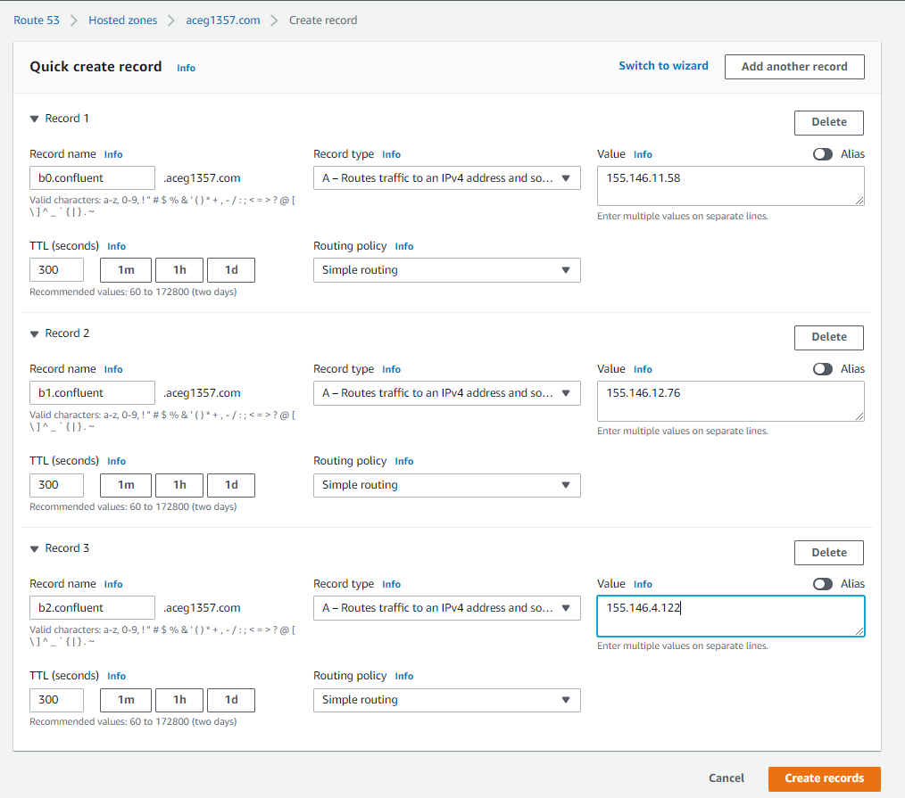

# Confluent on 5G Edge Tutorial

After creating EKS cluster + node groups, SSH onto WLZ node and get Kafka binaries:
```
wget https://apache.claz.org/kafka/2.8.0/kafka_2.13-2.8.0.tgz
sudo yum install java-1.8.0-openjdk
tar -xzf kafka_2.13-2.8.0.tgz
cd kafka_2.13-2.8.0/bin
ls
```

Next, take note of the IPs corresponding to each of the Kafka brokers:
`kubectl get pods`

Next, to configure cluster DNS, navigate to your `etc/hosts` file and add resource records to point to the K8S service objects for each Kafka broker:
```
127.0.0.1   localhost localhost.localdomain localhost4 localhost4.localdomain4
::1         localhost6 localhost6.localdomain6
10.0.0.94  kafka-0.kafka.confluent.svc.cluster.local    ##Edit this line to include first of 3 Private IPs for your WLZ nodes
10.0.0.194  kafka-1.kafka.confluent.svc.cluster.local   ##Edit this line to include second of 3 Private IPs for your WLZ nodes
10.0.0.112   kafka-2.kafka.confluent.svc.cluster.local  ##Edit this line to include third of 3 Private IPs for your WLZ nodes
```

Next, create a new topic `wavelength-cool-topic` and specify the private IP of your WLZ node (10.0.0.112)
./kafka-topics.sh --bootstrap-server 10.0.0.112:9092 --create --topic wavelength-cool-topic

Confirm that your `wavelength-cool-topic` was created properly:
./kafka-topics.sh --bootstrap-server 10.0.0.112:9092 --list


Let's now produce a message to the `wavelength-cool-topic` topic:
```
./kafka-console-producer.sh --bootstrap-server 10.0.0.112:9092 --topic wavelength-cool-topic
>Confluent is awesome!
```

Then, let's consume a message from the `wavelength-cool-topic` topic:
```
>./kafka-console-consumer.sh --bootstrap-server 10.0.0.112:9092 --topic wavelength-cool-topic --from-beginning
Confluent is awesome!
Processed a total of 1 messages
```

Edit etc/hosts file to incude your domain name:
```
127.0.0.1   localhost localhost.localdomain localhost4 localhost4.localdomain4
::1         localhost6 localhost6.localdomain6
10.0.0.240   b0.confluent.aceg1357.com
10.0.0.12  b1.confluent.aceg1357.com
10.0.0.97  b2.confluent.aceg1357.com
```

Next, create DNS records to resolve your confluent subdomain.


Then, from mobile device, download Kafka binaries and run the Kafka consumer.
